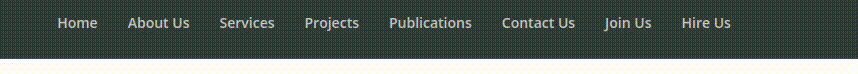
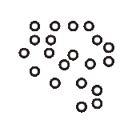
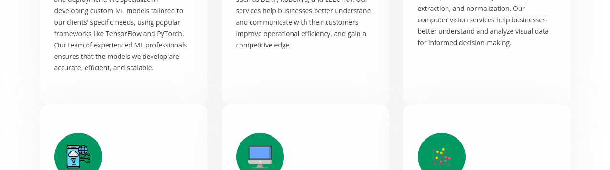
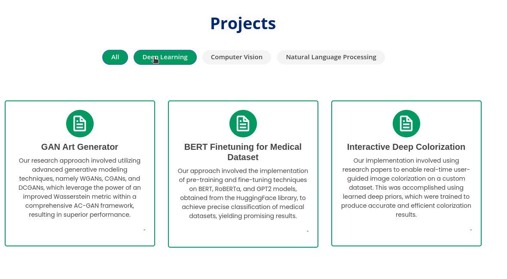
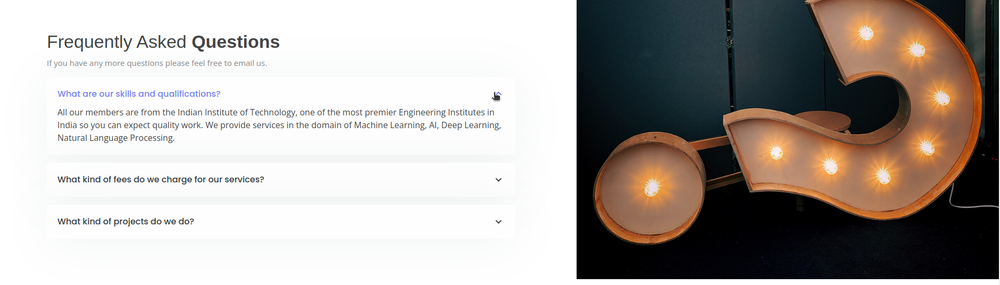
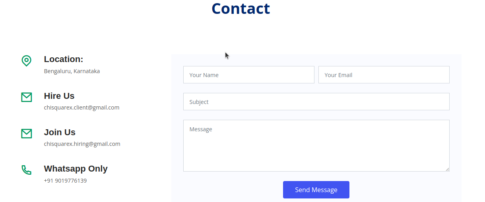
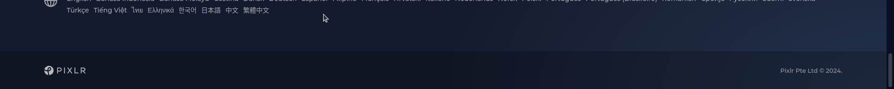

# Chi SquareX Proposal

 

## <u>Navbar Style fix</u>

#### From:

#### To:

## <u>Side Style fix</u>

#### Instead of popping up, it can be changed to be coming sliding from side like other standard websites

## <u>About Us Section</u>

#### It is so plain, its backbround can be cahnged to an svg background or make it like a card with a animation icon something like these:

## <u>Services Section</u>

#### Cards are overlapping and also their look can be enhanced by adding a box shadow and also making icons in the centre from both sides

## <u>Providing Solutions</u>

#### The text in this section is very small and is not visible as such, it would be better if it will be a little bigger and bolder

## <u>Projects Section</u>

#### The color of hovered section and current section is same. Also, appearance of card is to plain, it can be enhanced with a design like: Initially only title will be displayed then when hovered then an animation happens and description comes from bottom of card.

Something like what I've implemented in following pull request but with current design: [Github Pull Request](https://github.com/AlgoManiacZ/AlgoManiacZ_Revamped/pull/67)

## <u>Frequently Asked Questions Section</u>

#### In FAQ section, this big question mark image can be replaced by a animated icon which will enhance the look by meking FAQ accordian in centre and also having something animated will make it feel lively. Also, there is a issue with accordian that once any accordian then its not possible to close all accordians something one is always be opened if anyone is opened.

#### Icon Example:

## <u>Footer, Contact and Form</u>

#### The contact form can look better alone in a box and location details and emails can be integrated in footer and also footer can look better something like in the given image below and all contact information can be integrated in just above section with a lighter shade from footer jsut like in footer. It will look more professional.

## <u>Text appearance</u>

#### At some places, look can be enhanced by making element visible when it comes into viewport.

## I propose to do these changes in html and css. Please give it a thought and pick and choose what do you want.
