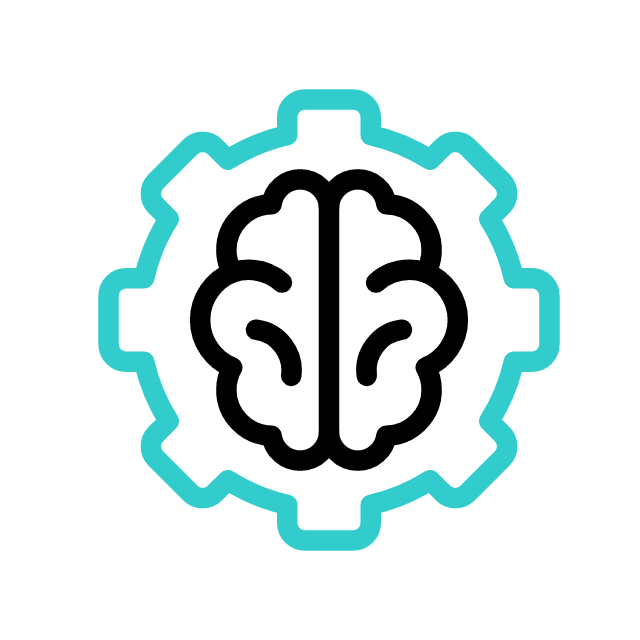
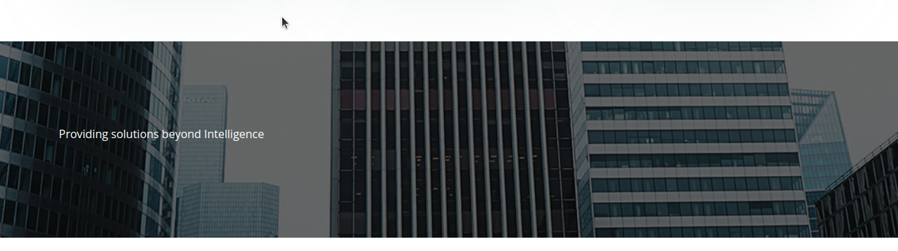

# Chi SquareX Proposal

 

## <u>Navbar Style fix</u>

#### From:

#### To:

## <u>Side Style fix</u>

#### Instead of popping up, it can be changed to be coming sliding from side like other standard websites

## <u>About Us Section</u>

#### It is so plain, its backbround can be cahnged to an svg background or make it like a card with a animation icon something like these:

## <u>Services Section</u>

#### Cards are overlapping and also their look can be enhanced by adding a box shadow and also making icons in the centre from both sides

## <u>Providing Solutions</u>

#### The text in this section is very small and is not visible as such, it would be better if it will be a little bigger and bolder

